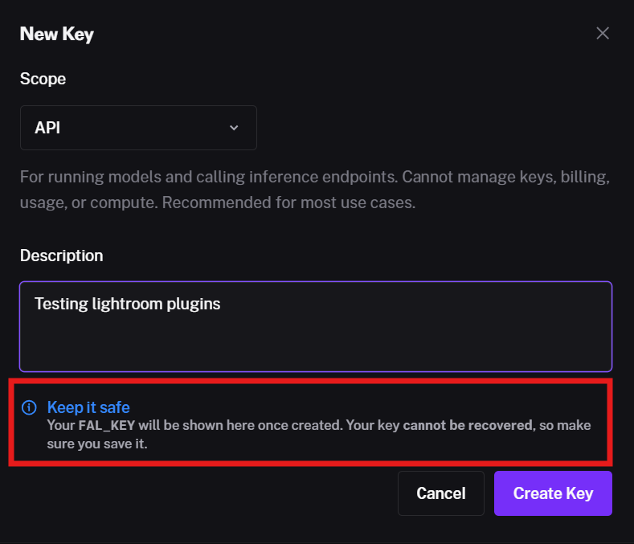

# Create and use fal.ai API keys

There are 2 types of API keys in fal.ai
- **API Keys:** For running models and calling inference endpoints. Cannot manage keys, billing, usage, or compute. Recommended for most use cases.
    - For our purposes, the API key allows Lightroom and the plugins to run AI models on your behalf
- **Admin Keys:** Full access — run models plus manage API keys, billing, usage data, and compute instances. Use for account management, automation, and integrations.
   - For our purposes, the plugins use this to show your your current balance

## Creating Keys
1. From the top menu in fal.ai, click **Settings** and then **API Keys**

  

2. Click **+ Add key**

  

3. Make sure the **Scope** is set to **"API"**
- Put something in the description
- ***Before you click "Create Key", make sure you are ready to copy and save this key to a secure location*** 
After it appears, it cannot be accessed directly again.
- If you do not copy and save it, just create a new key.  There is not a limit
- Click **Create Key**

4. Your new key will appear. My new key is redacted in the screenshot below.
- Copy your key and save it in a secure place.
- !! Anyone who gets your key can execute fal.ai processes on your behalf.

5. You are now ready to paste this key into the plugins
